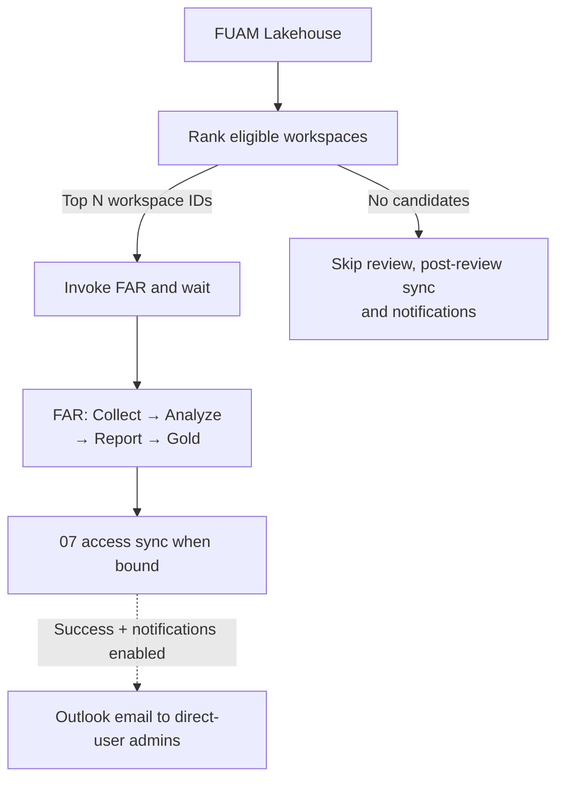

<!-- Copyright (c) Microsoft Corporation. Licensed under the MIT License. -->

# Fabric technical reference

Use this reference for Fabric run parameters, output tables, optional features
and troubleshooting. For installation and upgrades, follow
[Deploy FAR in Microsoft Fabric](DEPLOYMENT.md).
The [main README](../README.md) covers local execution, roles and the rule catalog.

> **Data safety:** like every run mode, the in-Fabric pipeline reads **metadata, configuration,
> inventory, and metrics only** — never customer business data. See
> [Data safety](../docs/data-safety.md).

---

## 📑 Table of contents

- [Step-by-step deployment guide](DEPLOYMENT.md)
- [Which tenant can each run mode reach?](#-which-tenant-can-each-run-mode-reach)
- [Deploy it from inside Fabric (no workstation needed)](#-deploy-it-from-inside-fabric-no-workstation-needed)
- [Pipeline parameters (selectable at run time)](#-pipeline-parameters-selectable-at-run-time)
- [How optional targeted reviews work](#how-optional-targeted-reviews-work)
- [Optional Workspace Owner report](#optional-workspace-owner-report)
- [The gold layer + Direct Lake governance report](#-the-gold-layer--direct-lake-governance-report)
- [Ask the data agent (conversational Q&A)](#-ask-the-data-agent-conversational-qa)
- [Build the estate graph (Fabric IQ ontology)](#-build-the-estate-graph-fabric-iq-ontology)
- [Explore the results in the interactive FAR app](#-explore-the-results-in-the-interactive-far-app)
- [Optional: Azure (ARM) auth for capacity Pause/Resume detection](#-optional-azure-arm-auth-for-capacity-pauseresume-detection)
- [Workspace logo (optional)](#-workspace-logo-optional)
- [Versioning & updates](#-versioning--updates)
- [Troubleshooting](#-troubleshooting)

---

## How optional targeted reviews work

The normal FAR pipeline can run on its own. For monitoring-driven reviews, open
the deployed `FabricArchReview_06_TargetedReviewSetup` notebook and opt in to a
parent pipeline:

| Configure | Where | Setting |
| --- | --- | --- |
| Deploy the parent | `06_TargetedReviewSetup` | `DEPLOY_TARGETED_REVIEW="true"` |
| Monitoring source | `06_TargetedReviewSetup` | `FUAM_WORKSPACE_ID`; set `FUAM_LAKEHOUSE_ID` explicitly when needed |
| Ranking and scope | Setup defaults or parent run parameters | `RANKING_METRIC="cu_seconds"`, `TOP_N="5"`, `LOOKBACK_DAYS="7"`; blank `WORKSPACE_IDS` selects from all eligible FUAM candidates, or supply a candidate allow-list. FAR/FUAM hosting workspaces are excluded |
| Review settings | Parent run parameters | Existing FAR engagement, collection and threshold parameters pass through |
| Post-review owner access sync | 06 advanced wiring | Base setup auto-stamps `OWNER_ACCESS_NOTEBOOK_ID` when owner reporting is enabled. Rerun 06 to bind it; blank leaves the original targeted flow |
| Native Outlook email | Parent's existing **Email workspace administrator** activity | Create/sign in to its connection in Settings, activate and save; set parent `FAR_REPORT_URL`; keep `NOTIFICATIONS_ENABLED="false"` until a scoped test |

CU-seconds is the default. `recorded_throttling_minutes` is an explicitly labelled,
potentially incomplete FUAM metric, not a count of throttled operations. There is
no unsupported direct Capacity Metrics query or automatic source fallback.
Set `CAPACITY_ID_OR_NAME` to an exact capacity name/GUID or a JSON list such as
`["Capacity A", "Capacity B"]`; leave it blank for all capacities. Metrics are
filtered before aggregation, then `TOP_N` workspaces are ranked across the
combined scope, not per capacity. Any unknown or ambiguous name fails the
selection. No eligible metrics in the selected scope skips the review.

The setup order is **base setup -> opt-in 06 -> targeted parent**. 06 creates the
parent and its selection/completion notebooks; it does not run a review. Schedule
the parent, not those notebooks. No candidates means no review, post-review sync
or email; it never becomes an unfiltered FAR run.

When bound, 07 runs after FAR and before email, even with notifications off.
Keep its separate daily schedule and avoid overlapping syncs. Standalone FAR
does not run 07. Notifications off means no recipient lookup or email.
When enabled, mail goes to current direct-user workspace administrators and
grants no report access. Setup neither configures sender credentials nor sends
test mail.

Follow the [deployment walkthrough](DEPLOYMENT.md#5-optionally-enable-fuam-targeted-reviews)
for setup and a controlled test. Use the [targeted-review reference](../docs/targeted-review.md)
for source contracts, parameters, notification operations and redeployment, and
the [data-safety statement](../docs/data-safety.md#optional-targeted-review-orchestration)
for recipient metadata and access boundaries.

## Optional Workspace Owner report

Set `DEPLOY_WORKSPACE_OWNER_REPORT="true"` to deploy a separate secured model
and report, independently of `DEPLOY_GOLD_REPORT`. Defaults:

- `OWNER_SEMANTIC_MODEL_NAME="Fabric Arch Review - Workspace Owner Model"`
- `OWNER_REPORT_NAME="Fabric Arch Review - Workspace Owner"`
- `OWNER_AGENT_NAME="Fabric Arch Review - Workspace Owner Agent"`

The owner report contains curated workspace/item findings, technical details,
executions and coverage, not the full FAR checklist or global risk score.
Latest-review views are workspace-specific. Tenant findings, capacity totals,
raw expressions and notebook code are excluded.

Follow the [owner quick start](../docs/workspace-owner-report.md#start-here-first-owner-report-deployment):
configure a fixed-identity connection with SSO disabled, run an owner-enabled
review and **07_OwnerAccessSync**, then approve readers. Readers need item-scoped
report/model **Read** and `WorkspaceOwner` membership. Give them **no FAR workspace
role, Build permission or raw Lakehouse/SQL access**. The governance report,
FAR app and central Data Agent are not protected by owner RLS.

Schedule 07 **daily** without overlapping other syncs; grants expire after
**24 hours**. Sync covers workspaces from owner-enabled reviews, not the whole
tenant, and does not grant report access or backfill review history.
Disabling owner deployment later does not stop projections, schedules or sharing.
See [owner operations and retirement](../docs/workspace-owner-report.md).

Owner reporting also provisions **08_OwnerAgent**, but does not run or share it.
Run it manually after Gold and 07 to publish chat against the secured owner model
only. Follow the [owner Agent guide](../docs/workspace-owner-agent.md).
Before sharing either experience, complete its **live Fabric acceptance with
actual readers**; deployment success and local tests do not establish isolation.

---

## 🧭 Which tenant can each run mode reach?

The default user/notebook-identity modes differ in **which tenant you can review**:

| | **Local (PowerShell)** | **In Fabric (notebook / pipeline)** |
| --- | --- | --- |
| Identity | Your signed-in user (`az login` / browser), via `azure.identity` | The notebook's executing identity, via `notebookutils` |
| Tenant targeted | **Any tenant** you have guest/member access to — set by `TENANT_ID` in `.env` | **Only the tenant that owns the Fabric workspace** — `TENANT_ID` is a label, it cannot redirect the token |
| Cross-tenant review | ✅ Yes — `az login --tenant <client>` then set `TENANT_ID=<client>` | ❌ No — run the notebook *inside the client's tenant* |
| Best for | Consultant reviewing a client tenant from their own machine | Client running it themselves, or a tenant-resident reviewer; unattended/scheduled runs |

> For the standalone collector's optional service-principal override, see
> [authentication modes](../docs/auth-setup.md#standing--unattended-mode--service-principal-optional).
> The opt-in [Azure (ARM) Pause/Resume scan](#-optional-azure-arm-auth-for-capacity-pauseresume-detection)
> is a separate local-only path.

---

## 🚀 Deploy it from inside Fabric (no workstation needed)

Follow [deployment steps 1–3](DEPLOYMENT.md) to prepare permissions, import
[setup.ipynb](setup.ipynb) and run a scoped review. Setup creates or reuses:

| Artifact | Default / behavior |
| --- | --- |
| Output Lakehouse | `fabric_arch_review_lh` |
| Stage notebooks | `FabricArchReview_01_Collect` through `04_Gold` |
| Standalone notebooks | `05_Agent` for central chat; `06_TargetedReviewSetup` for FUAM targeting |
| Pipeline | **Fabric Arch Review Pipeline**: Collect -> Analyze -> Report -> Gold |
| Governance model/report | **Fabric Arch Review - Governance**; skip with `DEPLOY_GOLD_REPORT="false"` |
| Owner model/report and notebooks 07/08 | Opt in with `DEPLOY_WORKSPACE_OWNER_REPORT="true"`; see [owner setup](DEPLOYMENT.md#4-optionally-finish-the-workspace-owner-report) |
| Estate ontology | Requires governance deployment and `DEPLOY_ONTOLOGY="true"`; see [ontology setup](#-build-the-estate-graph-fabric-iq-ontology) |

Setup does not run reviews, publish Agents, approve readers or enable schedules.
Set engagement and collection scope in the pipeline's **Run** dialog, not the
setup parameters cell. Blank `WORKSPACE_IDS` reviews all accessible workspaces.

Review output is in `Files/fabric-arch-review/<run-id>/report.md`, with collection
JSON in `raw/`, plus the governance Power BI report after Gold.
The Fabric pipeline does not generate PDFs; use the
[local PDF workflow](../REFERENCE.md#customizing-the-pdf--branding) when needed.

Rerunning setup updates generated artifacts and can overwrite manual changes.
Owner models have stricter compatibility checks: recognized older models upgrade
in place; unrecognized changes stop deployment. See [upgrading](DEPLOYMENT.md#upgrading).

---

## 🎛️ Pipeline parameters (selectable at run time)

Set these values in **Fabric Arch Review Pipeline > Run**, or on its schedule,
without redeploying. Check schedule overrides separately from pipeline defaults.

| Parameter | Default | What it does |
| --- | --- | --- |
| `GITHUB_REPO_URL` | this repo's clone URL | Repo the stages clone to get the analyzer code — change it if you forked |
| `GITHUB_BRANCH` | `main` | Branch read to discover the latest `VERSION` and used as the fallback if no release tag exists |
| `GITHUB_REF` | resolved release tag (`v<VERSION>`), or branch fallback | Code ref used by every stage, set by setup. Keep it unchanged for consistent runs; overriding it can mix runtime code with artifacts from another release |
| `SP_CLIENT_ID` / `SP_SECRET_KEYVAULT` / `SP_SECRET_NAME` | blank | Optional Collect-stage service-principal override: supply all three plus `TENANT_ID`; the notebook identity must be able to retrieve the Key Vault secret. An app ID alone does not activate it. See [auth-setup.md](../docs/auth-setup.md). |
| `SP_CONNECTION_NAME` | `sp-fabric-arch-review` | Compatibility setting only; the collector does not use this name to retrieve credentials or switch identity |
| `TENANT_ID` | blank | Report label in default notebook-identity mode (does **not** redirect that token); required authentication tenant for the explicit service-principal override |
| `WORKSPACE_IDS` | blank | Comma-separated workspace GUIDs to restrict the review; blank means no filter within the executing identity's permissions |
| `ACTIVITY_DAYS_LOG` | `7` | Admin Activity Log lookback window in days (1–28 per Fabric Admin API) |
| `CLIENT_NAME` | `Contoso` | Client name on the report cover |
| `ENGAGEMENT_NAME` | `Fabric Architecture Review` | Engagement title on the report cover |
| `REVIEWER_NAME` | blank | Reviewer name on the report cover |
| `CAPACITY_METRICS_APP_INSTALLED` | `false` | Opt-in Capacity Metrics App DAX collector; custom consumption of that model is unsupported by Microsoft. See [limitations](../docs/data-safety.md) before enabling |
| `CAPACITY_AUTO_PAUSE_CONFIGURED` | `false` | Keep `false` in Fabric (ARM scan is local-only — see below) |
| `VERTIPAQ_STATS_READ_DATA` | `false` | `true` adds exact column cardinality (aggregate COUNT DAX); default = sizes/encoding metadata only |

**Threshold tuning:** numeric thresholds in [thresholds.yaml](../config/thresholds.yaml)
are also optional pipeline parameters. Leave them blank for defaults, or adjust
them to agreed SLOs. See [tuning pass/fail thresholds](../REFERENCE.md#tuning-passfail-thresholds).

### Workspace classification in Fabric runs

`WORKSPACE_IDS` restricts collection scope but does **not** mark those workspaces as production.
The analyzers infer environment from separator-delimited workspace-name markers: `prod`,
`production`, or `live` means production; `dev`, `test`, `qa`, `uat`, `sbx`, `sandbox`,
`poc`, or `demo` means non-production; names without a marker remain `unknown`. Item composition
independently determines the workload archetype used by workload-specific rules.

When naming is not authoritative, define the workspace by immutable ID under `profile` in
[../config/workspaces.yaml](../config/workspaces.yaml), including `environment`, `archetype`, and
optional per-rule overrides. Fabric stages read that file from the deployed Git ref, so commit the
profile to the branch or release before running setup. Production-only rules exclude personal,
empty, and non-production workspaces; an unresolved environment produces `unknown`, not an assumed
pass or failure. Capacity-level environment overrides use `capacities[].profile.environment` in the
same file and take precedence over environments derived from assigned workspaces and capacity names.
See [Workspace classification and production scope](../REFERENCE.md#workspace-classification-and-production-scope)
for the complete precedence and configuration example.

---

## 🥇 The gold layer + Direct Lake governance report

The `04_Gold` stage writes findings and metadata to **Delta tables**, replacing
the current run's rows while preserving other runs for trend analysis.
Key tables in the [Gold schema](../reports/powerbi/schema.py):

| Table | Grain | Backs |
| --- | --- | --- |
| `gold_findings` | one row per evaluated rule per run | findings and aggregate review measures |
| `gold_run_summary` | one row per run | the run slicer + headline scorecard |
| `gold_dimension_summary` | one row per dimension per run | the *Overview* maturity radar + severity heatmap |
| `gold_capacities` | capacities at scan time | *Cost* / *Performance* pages |
| `gold_workspaces` | workspaces in scope (+ admin count, last activity, inactive flag) | *Governance* page + data agent |
| `gold_semantic_models` | models + storage mode + VertiPaq size / column counts | *Architecture* + *Semantic Models* pages |
| `gold_dax_models` | one metadata-only definition-coverage and DAX risk summary per model | *DAX Analyzer* page + data agent |
| `gold_dax_measures` | one row per DAX measure with capacity/model hierarchy and explainable static signals | *DAX Analyzer* page + data agent + ontology |
| `gold_item_executions` / `gold_execution_coverage` | native execution observations / per-item collection coverage per review | *Execution history* + data agent |
| `gold_dataflow_queries` / `gold_dataflows` | static M query signals / Gen2 inventory and definition coverage per review | *Dataflow Gen2* + data agent |
| `gold_dax_objects` / `gold_dax_object_coverage` | typed non-measure objects / model definition coverage per review | *DAX objects* + data agent |
| `gold_model_tables` | one row per model table (VertiPaq) | *Model detail* page |
| `gold_model_columns` | one row per model column (size, encoding, data type, cardinality) | *Model detail* page |
| `gold_model_partitions` | one row per model partition (mode, record/segment counts) | *Model internals* page |
| `gold_model_relationships` | one row per model relationship (cardinality, used size) | *Model internals* page |
| `gold_model_hierarchies` | one row per user hierarchy | *Model internals* page |
| `gold_notebook_smells` | per-notebook NBCODE matches | *Notebooks* page |
| `gold_workspace_risk` | one row per workspace (item mix, issue/risk score, status) | *Overview* top-risk bar + *Estate Map* |
| `gold_severity_matrix` | one row per dimension × severity | *Overview* + *Estate Map* severity heatmap |
| `gold_bpa_violations` | one row per individual BPA / Direct Lake / Delta / health violation | *Best Practices* page |
| `gold_graph_nodes` | estate entities (capacity, workspace, items, owners) | *Estate Map* inventory |
| `gold_graph_edges` | relationships between estate entities | *Estate Map* relationships |
| `gold_agent_eval` | one row per data-agent evaluation case per run (question, gold-derived expected answer, agent answer, passed) | *Agent Eval* page + accuracy KPI |

The semantic-model detail tables depend on the Fabric-only VertiPaq collector.
If it does not run or finds no resident models, the related pages can be empty.
Estate and risk tables depend on collected inventory and findings; missing
evidence does not establish a clean or empty estate.

**Best Practices** (`BPA-001..007`) covers model/report BPA, Direct Lake fallback,
Delta health, unused objects and capacity SKU readiness. Collection requires
Fabric and `semantic-link-labs`; outside Fabric it reports unavailable evidence.

The governance model uses **Direct Lake**, without an import refresh schedule.
The separate owner's entitlement sync still requires its model refresh/reframe
to complete. The governance report has **21 pages**:

| Page | What it shows |
| --- | --- |
| **Home** | Navigation to report pages |
| **Overview** | Maturity by dimension, best-practice score, failures by severity, highest-risk workspaces and findings |
| **Trends** | Run-over-run history — best-practice score, fails by severity, and per-dimension posture trended across every pipeline run |
| **Estate Map** | Workspace-risk hotspots (scatter), failures by dimension & severity, and the estate inventory / relationships tables |
| **Architecture, Performance, Cost, Governance, Operational Excellence, Security, Tenant Settings** | One page per dimension, with indicators, failing checks, supporting details and findings |
| **Best Practices** | Fabric-only BPA outcomes and violation counts by category |
| **Semantic Models** | Model size, column/calculated-column counts, storage mode and refresh signals |
| **DAX Analyzer** | Select capacity then semantic model; inspect measure counts, risk distribution, explainable static signals, and expression previews without executing DAX or claiming measured runtime cost |
| **Execution history** | Native refresh/job observations across reviews, duration and per-item coverage; repeated observations are not additional executions |
| **Dataflow Gen2** | Latest-review Gen2 definition coverage and static M query signals, with next investigation steps |
| **DAX objects** | Latest-review calculated columns, calculated tables and calculation items, explicitly separate from measure counts |
| **Model detail** | Select a model and table to inspect column data type, encoding, cardinality and size |
| **Model internals** | Per-model partitions, relationships, and user hierarchies |
| **Notebooks** | NBCODE code-smell matches, severity and affected notebooks |
| **Agent Eval** | Latest evaluation pass rate and per-question expected answers, Agent answers and results |

> **Custom visual note:** the *Overview* maturity radar uses the Microsoft-certified **Radar Chart**
> custom visual. If your tenant blocks custom visuals it
> renders a placeholder — every other visual on every page uses standard core visuals, so the rest of the
> report is unaffected.

> **First run:** the model and report have no review data until **04_Gold** succeeds.
> On a new Lakehouse, setup waits for the SQL analytics endpoint before deploying
> the model.

Read [native evidence](../docs/native-evidence.md) for source-history limitations,
snapshot deduplication and static-versus-runtime interpretation. The Data Agent
must be republished through **05 Agent** to use the expanded table selection and
instructions; this does not grant owner-isolated access to central data.

---

## 🤖 Ask the data agent (conversational Q&A)

Run **`FabricArchReview_05_Agent`** after the first successful pipeline run to
deploy and publish **Fabric Arch Review - Data Agent**. Follow the notebook's
SDK installation and kernel-restart instructions before running its deployment cells.

After upgrading FAR, rerun this standalone notebook to update the published
agent. Rerunning the review pipeline alone does not update it.

**For authorized central reviewers.** The owner model's
`WorkspaceOwner` role does not secure this Data Agent or its governance/Lakehouse
sources. Do not share the agent with owner consumers as part of owner approval.

**Grounded on two sources:**

- the **Direct Lake governance semantic model** — governed measures + rich column descriptions drive
  natural-language → DAX for scores, counts and roll-ups;
- the **approved Gold Lakehouse tables** — natural-language → SQL for detailed
  evidence, with built-in example question/query pairs. Examples are applied to
  non-semantic-model sources.

**Ask things like:**

- *“What's our best-practice score and the top critical findings?”*
- *“How can I improve the architecture design / reduce cost?”*
- *“How do I improve the semantic model ‘X’ / the notebook ‘Y’?”*
- *“Are we being throttled — do we need a bigger or smaller capacity?”* (PERF-001/002/011)
- *“Which workspaces are unused and could be closed?”* (empty workspaces + GOV-006)
- *“Which workspaces have only one admin?”* (GOV-001)
- *“Which observed refreshes or jobs failed, and where is execution history unavailable?”*
- *“Which Dataflow Gen2 queries have buffering or folding-barrier signals?”*
- *“Which calculated columns, tables or calculation items have the highest static risk?”*
- *“Which pipelines have missing dependencies or dependency cycles?”* (ARCH-016)

Native-evidence queries use each workspace's latest review when answering
current-state questions. Historical execution queries select the latest
observation of each execution **before** counting statuses or comparing
durations. Instructions keep measures separate from other DAX objects and
distinguish static patterns, successful empty collection and unavailable evidence.
Republish **05_Agent** after updating and populating the Gold tables.

**Enterprise posture**

- **Read-only.** The agent only generates read queries; it never writes or changes data.
- **Data-safe.** Its model contains *only* the review's findings and metadata — never customer
  business data — and the instructions tell it not to surface the reviewer's identity or raw
  evidence UPNs.
- **Governed.** Answers stay within the caller's Fabric permissions and any Microsoft Purview
  policies configured on its sources; interactions are auditable via Purview.
  FAR does not add owner RLS to these central sources. Agent instructions and
  sensitivity labels do not replace source authorization.
- **Traceable.** The published agent is stamped with the deployed FAR release version.
- **Endorsable.** Optionally endorse (Promoted / Certified) and apply a sensitivity label to the
  model, report and agent via the `ENDORSE_MODEL` and `SENSITIVITY_LABEL_ID` setup parameters
  (off by default; requires admin rights and a valid tenant label GUID).
- **Prerequisites:** a supported paid **F2+** capacity, or **P1+ with Fabric enabled**,
  and the required [Data Agent tenant settings](https://learn.microsoft.com/fabric/data-science/data-agent-tenant-settings),
  including applicable cross-geo AI processing/storage settings. Verify permissions
  on the published Agent and all attached sources as an intended reviewer.

### Self-checking accuracy (deterministic eval)

After publication, **05_Agent** runs fixed questions against the published Agent
and compares answers with expected values derived from Gold. Results are written
to `gold_agent_eval` and shown on the **Agent Eval** report page.
Use the pass rate and individual results to investigate grounding problems.
This check is not proof of general answer accuracy, permissions or owner isolation;
test the live experience with the intended identities before sharing.

---

## 🕸️ Build the estate graph (Fabric IQ ontology)

With governance deployment and `DEPLOY_ONTOLOGY="true"`, setup deploys
**Fabric_Arch_Review_Estate_Ontology** with entity types, relationships and Gold
bindings. Ontology names allow only letters, numbers and underscores.
This preview feature also requires a manual build and validation in Fabric.

**Prerequisites**

- The **"Users can create Ontology (preview) items"** tenant setting is enabled (Fabric admin portal).
- The **pipeline has run at least once**, so the gold tables hold data (an empty ontology can't build).

If deployment reports `403 FeatureNotAvailable`, check the tenant setting and
its scope. Core deployment can succeed without the ontology; rerun setup after
the setting takes effect, or set `DEPLOY_ONTOLOGY="false"` to skip it.

**Build and inspect**

1. Open the ontology in **Model** mode and inspect its generated types and source
   bindings. These include Capacity, Workspace, SemanticModel, DaxMeasure, Report
   and Finding, not a single generic `EstateNode` type.
2. Confirm the bindings use the FAR Lakehouse and populated Gold tables.
   Preserve `run_id` in keys and relationships so different reviews are not joined.
3. Save, switch to **Query** mode, select the entity/relationship types to explore
   and run the query. Validate the result against a known workspace and review.

Filter to one review for a snapshot of the estate. Setup completion alone does
not establish that the graph is populated or that every binding resolves.

**Optional Agent source:** after validating the ontology, open the central Data
Agent, choose **Add data source**, select the ontology and its entity types, then
**Save** and **Publish**. Setup does not add this source automatically. The Agent
already answers estate questions from the governance model and Lakehouse.

---

## 🖥️ Explore the results in the interactive FAR app

The **FAR app** is a Fabric-hosted workbench over the governance semantic model
with chat against the published central Data Agent. Run the pipeline and
**05_Agent** before connecting live data.

This is a **central-review app**, not the optional Workspace Owner report.
Owner RLS does not secure its model, raw Gold or chat bindings; do not include it
in an owner-only sharing audience.

Follow the [app guide](app/README.md) for prerequisites, live configuration and
deployment, or its [local preview](app/README.md#run-locally) to try synthetic
data without a tenant. Preview does not validate live Fabric access.

---

## ⚙️ Optional: Azure (ARM) auth for capacity Pause/Resume detection

**Keep `CAPACITY_AUTO_PAUSE_CONFIGURED=false` in Fabric.** FAR's ARM
Pause/Resume scan is supported only by the [local collection workflow](../REFERENCE.md#-running-the-review).
It checks capacity, Automation runbook and Logic App configuration for COST-002;
the notebook's Fabric token is not an ARM credential.

To enable it locally, sign in to the tenant that owns the capacity, grant that
identity Azure **Reader** on the relevant subscription, and set
`CAPACITY_AUTO_PAUSE_CONFIGURED=true`. Resource-group scope is sufficient when
all relevant resources are in that group. No write role or data-plane access
is needed. Default user mode requires neither a separate service principal nor
a Key Vault secret. When the scan is disabled, no ARM access is required.

---

## 🎨 Workspace logo (optional)

Use the supplied FAR logo as the workspace image if desired.

  

**Set it as the workspace image:**

1. **Download** the logo: open [`fabric/assets/FAR_logo.png`](assets/FAR_logo.png) on GitHub → **Download raw file** (or right‑click the preview above → *Save image as…*).
2. In Fabric, open your workspace → **Workspace settings** (the gear, or *⋯ → Workspace settings*).
3. Under **General → Workspace image** (also labelled *About* in some tenants), choose **Upload**, pick `FAR_logo.png`, then **Apply / Save**.

This changes only the workspace image. For a PDF cover logo, see
[report logo configuration](../reports/images/README.md).

---

## 🔖 Versioning & updates

The deployed release from [`VERSION`](../VERSION), code ref and commit SHA are
recorded in the Lakehouse's `meta_deployment` table.

**Where you see the version**

- **Power BI report — Home page**: a slim banner along the foot shows `FAR v<version> — up to date`,
  or **`Update available: v<newer>`** when a newer release has been published. It refreshes every time
  the pipeline runs the gold stage (`gold_release` table).
- **Markdown / PDF report**: the cover page lists the **FAR version** used to generate it.

**How update detection works**

Gold compares the deployed version with `VERSION` on GitHub's `main` branch.
If GitHub is unreachable, the report shows the deployed version without an
update notice; that absence does not prove the deployment is current.

**Pinned releases — every run uses the version you deployed**

Setup selects `RELEASE_TAG` when supplied, otherwise the tag matching the selected
branch's `VERSION` (`v<version>`). It passes the resolved `GITHUB_REF` to every
pipeline stage. Published tags must not be moved, and run/schedule overrides
should leave that ref unchanged.

**If the tag cannot be resolved, setup warns and falls back to the branch.**
Subsequent runs can then pick up branch changes. For repeatable scheduled runs,
use a published tag and verify setup reports it, not the branch fallback.

**How to update**

Follow the [upgrade procedure](DEPLOYMENT.md#upgrading), including pausing
schedules, rerunning setup and optional 06, republishing enabled Agents and
testing before resuming. Lakehouse review history is preserved, but generated
notebooks, pipelines and reports can overwrite manual customizations.

Compatible owner models are reused; recognized older models upgrade in place
with memberships and connections retained. Unrecognized changes stop deployment.
Use [owner-model recovery](DEPLOYMENT.md#existing-owner-model-mismatch), not table
deletion or a compatibility bypass.

---

## 🩺 Troubleshooting

| Symptom | Cause / fix |
| --- | --- |
| `git clone` exit 128 when running a stage notebook standalone | Stage notebooks are meant to run **inside the pipeline** (it injects `GITHUB_REF`). Run the pipeline, or set `GITHUB_BRANCH` / `GITHUB_REF` to a valid ref. |
| pip reports dependency conflicts | Review the conflicting versions and verify imports before running. A zero pip exit code alone does not prove Fabric's preinstalled packages remain compatible. |
| *Semantic Models* / *Model detail* / *Model internals* pages are empty | The `vertipaq_stats` collector did not run, or no models were resident in memory at scan time. |
| *Overview* maturity radar shows a "can't display this visual" placeholder | Your tenant blocks custom visuals. The radar is the only custom visual; every other visual still renders. Allow the Microsoft-certified *Radar Chart* in **Admin portal → Tenant settings → custom visuals**, or ignore it. |
| Model + report show no data after deploy | Expected on first deploy — they light up after the pipeline runs **once** (the `04_Gold` stage fills the Delta tables). |
| Collect reports incomplete evidence | Inspect the recorded component and service error code. Other workspaces/items continue; unavailable counts are unknown, not zero. The summary includes per-model/probe errors, not just failed stages. |
| Owner Executions/Coverage are blank despite governance execution rows | Compare the same run's workspace and owner table counts. See [owner evidence recovery](../docs/workspace-owner-report.md#executions-or-coverage-missing-for-a-run); neither Dataflows nor a targeted pipeline is required. |
| Pause/Resume (COST-002) shows "skipped" | Expected in Fabric — the ARM scan is local-only. Run the local CLI flow for that check. |

---

For the local workflow, configuration reference, rule catalog, and contribution guide, see the
[main README](../README.md). Microsoft, Fabric, and Power BI are trademarks of the Microsoft group of
companies.
