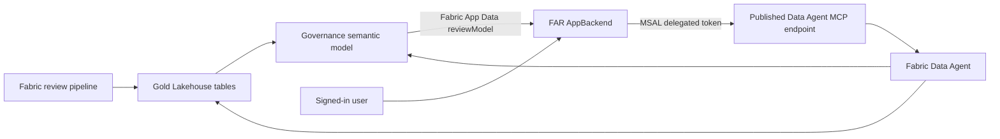

<!--
Copyright (c) Microsoft Corporation. All rights reserved.
Licensed under the MIT License. See LICENSE.TXT in the project root for full license information.
-->

# Fabric Architecture Review app

The Fabric Architecture Review (FAR) app is a Fabric-hosted workbench for exploring
the latest review: scores, prioritized findings, workspace inventory, DAX risks,
execution history, performance and cost signals, and Data Agent chat.

The app consumes review metadata and aggregate engineering statistics. It does not query customer business rows, notebook source, or notebook output.

**Central reviewers only:** owner RLS does not secure this app, its governance
model or its central Data Agent. App filters are navigation, not authorization.
Do not rebind `reviewModel` to the owner model or include this app in an
owner-only audience. For owner access, use the separate
[Workspace Owner report](../../docs/workspace-owner-report.md) and
[Workspace Owner Agent](../../docs/workspace-owner-agent.md).

## Choose your path

| Goal | Start here | Success |
| --- | --- | --- |
| Try the UI without a tenant | [Run locally](#run-locally) | Browser opens anonymous sample data with `?preview=1` |
| Connect a live review | [Prerequisites](#prerequisites), then [semantic model](#configure-the-semantic-model) and [chat configuration](#configure-rayfin-and-data-agent-chat) | The intended identity can query the model and published agent |
| Publish the app in Fabric | [Build and test](#build-and-test), then [Deploy](#deploy-to-fabric) | Fabric-hosted app shows the intended review and authorized chat |

Do not deploy or grant permissions just to try the preview. Keep existing live
configuration files when switching between tasks.

## Current architecture



- The application shell is a static React/Vite site hosted by an existing Fabric AppBackend through Rayfin.
- Live lens data is queried from the `reviewModel` semantic-model binding through Fabric App Data.
- The **DAX Analyzer** lens filters capacity first and semantic model second, then shows explainable static expression risks. It never executes DAX or presents its scores as measured duration, CU, or cost.
- **Native evidence** covers execution history, Dataflow Gen2 syntax/coverage, and calculated-DAX objects. Pipeline structural findings (ARCH-016) identify affected workspaces and items.
- Data Agent chat runs directly from the browser using a delegated Microsoft Entra token and MCP Streamable HTTP.
- The semantic model, Data Agent, and app may be in different Fabric workspaces. Configure each item with its actual parent workspace ID.

### Native evidence

The page scopes evidence by review, capacity, workspace and item IDs. Historical
capacity assignments come from the corresponding review, not today's inventory.

| Lens | Governance tables | Interpretation |
| --- | --- | --- |
| Observed executions | `gold_execution_coverage`, `gold_item_executions` | Refresh/job observations, UTC times and duration in milliseconds when available. Repeated observations are deduplicated before status filtering; this is not a complete execution log. |
| Dataflow Gen2 | `gold_dataflows`, `gold_dataflow_queries` | Metadata-only M syntax signals, never folding/runtime proof. Empty artifact IDs represent inventory gaps, not dataflows. |
| Calculated DAX objects | `gold_dax_object_coverage`, `gold_dax_objects` | Typed calculated columns/tables/items and static risks, without expressions. DAX-001/002 remain measure-only. |

Successful empty collections, partial collection, unavailable evidence and query
failures are distinct. Coverage remains visible under execution-status filters.
Queries have a 5,000-row safety limit; use the governance model for larger results.
Live failures never substitute preview data. See [native evidence](../../docs/native-evidence.md)
for coverage and interpretation limits.

**Chat does not inherit page filters.** Include the workspace/item IDs and review
or time window in your question. Native-evidence questions without an explicit
scope default to each workspace's latest review, which can differ from the
single run shown on the page.

## Prerequisites

For local preview, use **Node.js 22.13 or later in the 22.x series**, npm 10 and
the two example configuration files in [Run locally](#run-locally).
`npm ci` installs both Rayfin and Fabric App Data CLIs; no global install is needed.
The development and build commands generate environment settings and model bindings.
The test commands also generate model bindings from `fabric.yaml` before Vitest starts.

For a live app, also have:

- A completed [in-Fabric deployment and review](../DEPLOYMENT.md), with populated
  Gold tables and the governance semantic model. Local collection alone is insufficient.
- A published central Data Agent, deployed by **05_Agent** after Gold, on a
  [supported capacity with the required tenant settings](../REFERENCE.md#-ask-the-data-agent-conversational-qa).
- Azure CLI signed in to the intended tenant for deployment and command-line checks.
- Contributor or Admin access to the app workspace for the **deployer**, and
  Fabric Apps enabled for that identity.
- Access to the governance model, published Data Agent and its attached sources
  for each intended reviewer.

## Microsoft Entra configuration

Create a single-tenant **Single-page application** registration for Data Agent chat:

1. Add delegated Microsoft Fabric permission `DataAgent.Execute.All`.
2. Grant tenant admin consent.
3. Add the local callback URI `http://localhost:5173/auth-callback.html` when local chat is required.
4. After deployment, add `https://<generated-host>.webapp.fabricapps.net/auth-callback.html` as a SPA redirect URI.
5. Do not create or expose a client secret. The browser uses authorization code with PKCE.

For local chat, use `localhost:5173` to match the registered callback. The
`127.0.0.1` address below is for anonymous preview.

## Configure the semantic model

```powershell
cd fabric\app
npm ci
if (-not (Test-Path fabric.yaml)) { Copy-Item fabric.example.yaml fabric.yaml }
az login --tenant <tenant-id>
npx fabric-app-data add semanticModel reviewModel --from-url "<semantic-model-url>"
npx fabric-app-data generate -o src/fabric.generated.ts
npx fabric-app-data query reviewModel --query "EVALUATE ROW(`"connected`", 1)"
```

`fabric.yaml` and `src/fabric.generated.ts` contain tenant-specific bindings and are ignored by Git. The alias must remain `reviewModel` because the live queries use that connection name.

## Configure Rayfin and Data Agent chat

Create the configuration if missing, then replace the example identifiers:

```powershell
if (-not (Test-Path rayfin\.env)) { Copy-Item rayfin\.env.example rayfin\.env }
```

```dotenv
RAYFIN_PUBLIC_ENTRA_CLIENT_ID=11111111-2222-4333-8444-555555555555
RAYFIN_PUBLIC_DATA_AGENT_ID=66666666-7777-4888-8999-aaaaaaaaaaaa
RAYFIN_PUBLIC_DATA_AGENT_WORKSPACE_ID=bbbbbbbb-cccc-4ddd-8eee-ffffffffffff
RAYFIN_PUBLIC_FRONTEND_PORT=5173
```

Use the workspace that actually contains the published Data Agent. A valid Data Agent ID paired with the wrong workspace returns `InvalidRequestUri`.

These are public identifiers. Never place client secrets, bearer tokens, connection strings, or private keys in `RAYFIN_PUBLIC_*` or `VITE_*` variables. Rayfin adds the app tenant, workspace, item, API URL, and publishable key after app selection or deployment. Generate Vite settings with:

```powershell
npx rayfin env --framework vite
```

Deployment commands (`rayfin login`, `rayfin up`) require an authenticated Azure CLI session (`az login`).

## Run locally

From `fabric/app`, install dependencies and create **both** placeholder
configuration files if missing. Keep existing live configuration unchanged:

```powershell
npm ci
if (-not (Test-Path fabric.yaml)) { Copy-Item fabric.example.yaml fabric.yaml }
if (-not (Test-Path rayfin\.env)) { Copy-Item rayfin\.env.example rayfin\.env }
npm run dev -- --host 127.0.0.1
```

- Open `http://127.0.0.1:5173/?preview=1` for anonymous synthetic UI data.
- `fabric.yaml` is needed by the predev generator even for preview; the example
  supplies placeholder bindings, not live data access.
- Live semantic-model acceptance must be performed through the Fabric AppBackend item.
- Production builds never fall back to preview fixtures.

## Validate Data Agent grounding

Test the published endpoint with the same workspace and item IDs used by the browser:

```powershell
npm run agent:ask -- `
    --workspace-id <data-agent-workspace-id> `
    --agent-id <published-data-agent-id> `
    --question "What should we fix first?"
```

The probe tests the published endpoint using the Azure CLI identity; it does
not validate browser sign-in or the Fabric-hosted app. The browser adds
review-grounding instructions, while the probe sends your question directly,
so identical answers are not expected. If their data appears to differ, verify:

1. The endpoint built from the configured IDs matches the published agent's
   **Settings > Model Context Protocol** URL.
2. The configured workspace is the parent workspace of that Data Agent item.
3. The latest FAR pipeline run populated `gold_run_summary`, `gold_findings`, and `gold_notebook_smells`.
4. The agent was republished after source or instruction changes.
5. The signed-in user can read the agent and all attached sources.

The app displays the returned text without a separate summarization step.

## Build and test

```powershell
npm ci
if (-not (Test-Path fabric.yaml)) { Copy-Item fabric.example.yaml fabric.yaml }
if (-not (Test-Path rayfin/.env)) { Copy-Item rayfin/.env.example rayfin/.env }
npm test
npm run lint
npm run build:fabric
```

The build generates model bindings, checks TypeScript and bundles the app,
sign-in pages and third-party notices. These local checks do **not** establish
live access or deployment acceptance. For dependency audits and contributor
validation, follow the [contributor checks](../../CONTRIBUTING.md#required-validation).

## Deploy to Fabric

For initial app selection or provisioning:

```powershell
npx rayfin login --select
npx rayfin up --workspace-uri "<fabric-app-workspace-url>" --dry-run --yes
npx rayfin up --workspace-uri "<fabric-app-workspace-url>" --yes
```

For subsequent releases to the configured existing AppBackend, deploy static content only:

```powershell
npx rayfin up staticapp deploy --verbose
```

Open the AppBackend item from the Fabric portal as an intended reviewer. Verify
that it shows the expected review and that chat sign-in and source access work.
Local preview and unit tests do not replace this live acceptance.
Do not enable `services.functions`; the supported runtime is static hosting
plus direct delegated Data Agent MCP access.

See the repository [data-safety contract](../../docs/data-safety.md), [contribution guide](../../CONTRIBUTING.md), and [security policy](../../SECURITY.md).
