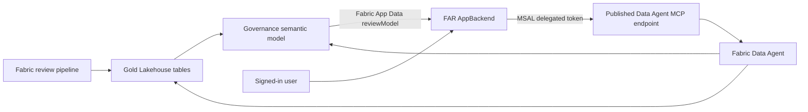

<!--
Copyright (c) Microsoft Corporation. All rights reserved.
Licensed under the MIT License. See LICENSE file in the project root for full license information.
-->

# Fabric Architecture Review app

The Fabric Architecture Review (FAR) app is a Fabric-hosted React workbench for exploring the latest architecture-review run. It presents the review score, prioritized findings, workspace estate, governance posture, semantic-model optimization, performance and cost signals, architecture inventory, notebook code smells, and a conversational Fabric Data Agent.

The app consumes review metadata and aggregate engineering statistics. It does not query customer business rows, notebook source, or notebook output.

## Current architecture



- The application shell is a static React/Vite site hosted by an existing Fabric AppBackend through Rayfin.
- Live lens data is queried from the `reviewModel` semantic-model binding through Fabric App Data.
- Data Agent chat runs directly from the browser using a delegated Microsoft Entra token and MCP Streamable HTTP.
- The semantic model, Data Agent, and app may be in different Fabric workspaces. Configure each item with its actual parent workspace ID.
- Rayfin Functions and Azure Functions are disabled and are not part of this implementation.

## Prerequisites

> **The app visualizes an existing review — run the review first.** The live data, governance
> semantic model, and Data Agent below are produced by running the FAR review at least once. Deploy
> and run the pipeline (and the `05_Agent` notebook) from the [in-Fabric guide](../README.md), or use
> the local PowerShell workflow in the [main README](../../README.md). To only see the UI, skip
> straight to [Run locally](#run-locally) with `?preview=1` — that uses anonymous sample data and
> needs none of the prerequisites below.

- Node.js 22 and npm.
- Run `npm ci` once before any other command. This installs the bundled **Rayfin CLI** (`@microsoft/rayfin-cli`) and **Fabric App Data CLI** (`@microsoft/fabric-app-data-cli`) as dev dependencies. They back every `npx rayfin` / `npx fabric-app-data` command and the automatic `predev` / `prebuild` hooks, so **no separate or global install of Rayfin is required** — `npm ci` is the only prerequisite install.
- A `rayfin/.env` file (copy `rayfin/.env.example`). `rayfin env` runs automatically before `npm run dev` and `npm run build`, and fails if this file is missing.
- Azure CLI (`az login`) for local Fabric validation, `rayfin login`, and the command-line Data Agent probe.
- A completed FAR pipeline run with populated gold tables.
- A governance semantic model generated by FAR.
- A published Fabric Data Agent on supported paid Fabric capacity.
- Contributor or Admin access to the Fabric app workspace.
- Read access to the Data Agent and every source attached to it.
- Fabric Apps enabled for the deployer in the Fabric tenant.

## Microsoft Entra configuration

Create a single-tenant **Single-page application** registration for Data Agent chat:

1. Add delegated Microsoft Fabric permission `DataAgent.Execute.All`.
2. Grant tenant admin consent.
3. Add the local callback URI `http://localhost:5173/auth-callback.html` when local chat is required.
4. After deployment, add `https://<generated-host>.webapp.fabricapps.net/auth-callback.html` as a SPA redirect URI.
5. Do not create or expose a client secret. The browser uses authorization code with PKCE.

The app uses a dedicated callback page and a same-origin popup relay because it runs inside a cross-origin Fabric iframe. Both pages are built as Vite entry points.

## Configure the semantic model

```powershell
cd fabric/app
npm ci
Copy-Item fabric.example.yaml fabric.yaml
az login --tenant <tenant-id>
npx fabric-app-data add semanticModel reviewModel --from-url "<semantic-model-url>"
npx fabric-app-data generate -o src/fabric.generated.ts
npx fabric-app-data query reviewModel --query "EVALUATE ROW(`"connected`", 1)"
```

`fabric.yaml` and `src/fabric.generated.ts` contain tenant-specific bindings and are ignored by Git. The alias must remain `reviewModel` because the live queries use that connection name.

## Configure Rayfin and Data Agent chat

Copy the public example and replace the UUID-shaped values:

```powershell
Copy-Item rayfin/.env.example rayfin/.env
```

```dotenv
RAYFIN_PUBLIC_ENTRA_CLIENT_ID=11111111-2222-4333-8444-555555555555
RAYFIN_PUBLIC_DATA_AGENT_ID=66666666-7777-4888-8999-aaaaaaaaaaaa
RAYFIN_PUBLIC_DATA_AGENT_WORKSPACE_ID=bbbbbbbb-cccc-4ddd-8eee-ffffffffffff
RAYFIN_PUBLIC_FRONTEND_PORT=5173
```

Use the workspace that actually contains the published Data Agent. A valid Data Agent ID paired with the wrong workspace returns `InvalidRequestUri`.

These are public identifiers. Never place client secrets, bearer tokens, connection strings, or private keys in `RAYFIN_PUBLIC_*` or `VITE_*` variables. Rayfin adds the app tenant, workspace, item, API URL, and publishable key after app selection or deployment. Generate Vite settings with:

```powershell
npx rayfin env --framework vite
```

You do not need to install Rayfin separately: `npm ci` already installed `@microsoft/rayfin-cli`, so `npx rayfin` resolves the local copy. `npm run dev` and `npm run build` run `rayfin env` automatically through their `predev` / `prebuild` hooks, so make sure `npm ci` has run and `rayfin/.env` exists first. Deployment commands (`rayfin login`, `rayfin up`) additionally require an authenticated Azure CLI session (`az login`).

## Run locally

```powershell
npm run dev -- --host 127.0.0.1
```

- Open `http://127.0.0.1:5173/?preview=1` for anonymous synthetic UI data.
- Live semantic-model acceptance must be performed through the Fabric AppBackend item.
- Production builds never fall back to preview fixtures.

## Validate Data Agent grounding

Test the published endpoint with the same workspace and item IDs used by the browser:

```powershell
npm run agent:ask -- `
    --workspace-id <data-agent-workspace-id> `
    --agent-id <published-data-agent-id> `
    --question "What should we fix first?"
```

The embedded app and the command-line probe call the same published MCP tool. Answers can still vary between independent chat sessions. If the Fabric Data Agent item and app appear to use different data, verify:

1. The app uses the MCP URL copied from the published agent's **Settings > Model Context Protocol** page.
2. The configured workspace is the parent workspace of that Data Agent item.
3. The latest FAR pipeline run populated `gold_run_summary`, `gold_findings`, and `gold_notebook_smells`.
4. The agent was republished after source or instruction changes.
5. The signed-in user can read the agent and all attached sources.

The app does not rewrite prompts or summarize MCP output; it displays the text blocks returned by the published tool.

## Build and test

```powershell
npm test
npm run lint
npm run build:fabric
npm audit --omit=dev --audit-level=high
```

The production build performs a full TypeScript project check before Vite bundles
`index.html`, `auth-callback.html`, `popup-relay.html`, and generated third-party notices.
The root CI workflow also audits Python runtime dependencies and parses the Bash and
PowerShell orchestration scripts.

## Deploy to Fabric

For initial app selection or provisioning:

```powershell
npx rayfin login --select
npx rayfin up --workspace-uri "<fabric-app-workspace-url>" --dry-run --yes
npx rayfin up --workspace-uri "<fabric-app-workspace-url>" --yes
```

For subsequent releases to the configured existing AppBackend, deploy static content only:

```powershell
npx rayfin up staticapp deploy --verbose
```

Open the AppBackend item from the Fabric portal for acceptance testing. Do not enable `services.functions`; the supported runtime is static hosting plus direct delegated Data Agent MCP access.

See the repository [data-safety contract](../../docs/data-safety.md), [contribution guide](../../CONTRIBUTING.md), and [security policy](../../SECURITY.md).
